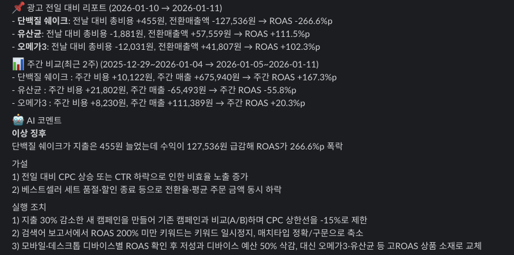
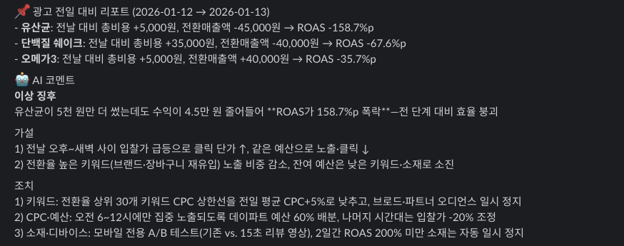

# AD-ALERT-BOT : AI 기반 광고 성과 분석 및 슬랙 알림 봇

광고 성과 데이터를 자동으로 분석하여 전일 대비 변동폭을 계산하고  
LLM(Hugging Face)을 통해 인사이트와 조치 제안을 슬랙으로 전송하는 자동화 봇입니다.

## 핵심 기능
- **데이터 누적** : `today.csv`를 읽어 `history.csv`에 **날짜 단위로 업데이트/추가**합니다. (여러 날짜 업로드도 지원)
- **성과 지표 분석** : 상품 단위로 비용/매출/전환/ROAS를 집계하고, **가장 최신 날짜 1개 기준 전일 대비** 리포트를 생성합니다.
- **주간 비교 리포트(조건부)** : 최신 업로드 날짜가 일요일이면 최근 2주(Week-2 → Week-1) 비교를 추가로 생성합니다.  
- **AI 인사이트 생성** : LLM이 퍼포먼스 마케터 관점으로 데이터를 해석해  
  `1. 이상 징후 TOP1 1줄 요약` `2. 원인 가설 2개` `3. 내일 조치 3개` 를 제안합니다.
- **Slack 자동 전송** : Slack Incoming Webhook으로 리포트를 자동 전송합니다.
- **업로드 감지 알림** : `--notify-missing` 옵션으로 “데이터 미업로드/미갱신”을 Slack으로 리마인드할 수 있습니다.


## 기술 스택
- **Language** : Python 3.9+
- **Data Analysis** : Pandas
- **AI/LLM** : Hugging Face Inference API (OpenAI SDK Compatible)
- **Automation** : Crontab / Python Argparse
- **Communication** : Slack Webhook API

## 📂 프로젝트 구조
```text
├── src/
│   ├── main.py          # 전체 파이프라인 제어 및 실행 스크립트
│   ├── io_csv.py        # CSV 데이터 로드 및 병합(Upsert) 로직
│   ├── metrics.py       # 일간/주간 성과 지표 계산 및 포맷팅
│   ├── llm_hf.py        # LLM 연동 및 분석 프롬프트 관리
│   └── slack.py         # 슬랙 메시지 전송 모듈
├── data/
│   ├── today.csv        # 신규 광고 데이터 (업로드 대상)
│   └── history.csv      # 누적 광고 데이터
├── .env                 # API 키 및 환경 변수 (Git 제외)
├── .gitignore           # 업로드 제외 설정
├── requirements.txt     # 의존성 라이브러리 목록
└── README.md            # 프로젝트 문서
```

## 동작 방식
1. CSV 업로드 : data/today.csv에 최신 데이터를 덮어쓰기(또는 여러 날짜를 한 번에 업로드)
2. 업로드 감지 : today의 최신 날짜가 history 최신 날짜보다 최신인지 판단
3. History Upsert : today에 포함된 날짜들을 history에서 제거 후 최신 데이터로 삽입 + 정렬 저장
4. 지표 계산
   `4-1. (기본) 최신 날짜 1개 기준 전일 대비 리포트 생성`
  `4-2. (조건부) 최신 날짜가 일요일이면 최근 2주 주간 비교 리포트 생성`
5. AI 코멘트 생성 : 요약 텍스트를 LLM에 전달하여 인사이트 생성(실패 시 폴백)
6. Slack 전송 : 리포트 + AI 코멘트를 Slack Webhook으로 전송

## 📊 리포트 예시
이 봇은 매일 설정된 시간에 다음과 같이 전일 대비 성과 요약과 AI 분석 코멘트를 슬랙으로 전송합니다.

| 1) 일간/주간 통합 리포트 | 2) AI 기반 심층 분석 및 조치 제안 |
| :---: | :---: |
|  |  |
| *전일 대비 및 주간 지표 요약* | *이상 징후 탐지 및 조치 제안* |

## 주요 기능 상세
**1) 지능형 데이터 Upsert & 무결성 관리**
- 날짜 단위 upsert : today.csv에 포함된 날짜는 history에서 동일 날짜 데이터를 제거한 뒤 최신 데이터로 교체합니다.
- 다중 날짜 업로드 지원 : 월요일에 금/토/일 데이터를 한 번에 업로드해도 정상 처리됩니다.
- 데이터 정제(Cleaning)
  - 숫자 컬럼은 NaN → 0
  - 문자열 컬럼은 공백 제거(strip)
  - date 파싱 실패 데이터는 제거
  - **0바이트(today.csv가 완전히 빈 파일)** 인 경우도 예외 없이 빈 DF로 처리(EmptyDataError 방어)

**2) 시계열 기반 성과 변동 분석**
- 전일 대비 분석
  - 최신 업로드 날짜를 기준으로 history에서 today_date보다 작은 날짜 중 가장 가까운 날짜를 찾아 비교합니다.
  - 주말/공휴일로 날짜가 비어 있어도 “가장 가까운 과거 날짜”를 찾아 분석이 끊기지 않습니다.

- 주간 비교(최근 2주)
  - 최신 날짜가 일요일일 때만 수행합니다.
  - Week-1(최근 7일) vs Week-2(그 전 7일)을 비교하여 ROAS 변동이 큰 상품을 우선 노출합니다.

**3) LLM 기반 실행형 코멘트 생성**
- 퍼포먼스 마케터 페르소나로 지표를 해석합니다.

- 출력 포맷
  - 이상 징후 TOP1 한 줄
  - 원인 가설 2개
  - 내일 바로 할 조치 3개 (키워드/CPC/소재/디바이스/예산 관점)

- 안정성 : LLM 호출 실패 시에도 리포트 전송이 끊기지 않도록 폴백 메시지를 반환합니다.

**4) 운영 자동화 최적화**
- --notify-missing 옵션 사용 시 아래 로직으로 “리마인드 알림”을 Slack으로 전송합니다.
  - today.csv 없음/비어있음 → 업로드 요청 알림
  - today.csv 있음 + 새 데이터 아님 → 아직 업데이트 안 됨 알림
  - today.csv 있음 + 새 데이터 → 즉시 분석 후 리포트 전송

## 실행 방법
1) 로컬 실행(즉시 리포트 생성)
`python src/main.py`

2) 업로드 감지 알림(크론용)
`python src/main.py --notify-missing`

3) 강제 실행(같은 날짜 재업로드 검증용)
`python src/main.py --force`

## Crontab 예시 (자동화 설정)

서버(Linux/Mac) 환경에서 매일 특정 시간에 봇을 자동 실행하려면 `crontab -e` 명령어로 아래 설정을 추가합니다.

```bash
# 매일 오전 10:00에 실행 (데이터 미업로드 시 슬랙 알림 발송)
00 10 * * * cd /path/to/AD-ALERT-BOT && /usr/bin/python3 src/main.py --notify-missing

# 매일 오후 18:00에 실행 (강제 재확인용)
00 18 * * * cd /path/to/AD-ALERT-BOT && /usr/bin/python3 src/main.py
```

  
---
### 주의사항
- **데이터 보안** : 본 프로젝트의 README 및 스크린샷에 사용된 모든 수치와 상품명(유산균, 단백질 쉐이크 등)은 기능 시연을 위해 생성된 **가상 데이터(Fake Data)**입니다. 
- **LLM 코멘트** : AI가 생성한 분석 및 제안은 실제 비즈니스 상황에 따라 유효성이 다를 수 있으므로 마케터의 최종 검토가 필요합니다.
